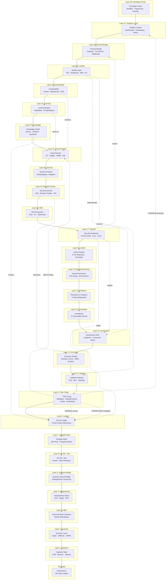

# ATLAS Architecture — Mermaid Diagram

```mermaid
graph TD
    subgraph "Layer 28: Developer Portal"
        DP[Developer Portal<br/>Sandbox · Playground · Tutorials]
    end
    subgraph "Layer 27: Analytics & Viz"
        AV[Analytics Engine<br/>Dashboards · Forecasting · Alerts]
    end
    subgraph "Layer 26: Protocol Bridge"
        PB[Protocol Bridge<br/>Gateway · Connectors · Webhooks]
    end
    subgraph "Layer 25: Identity"
        ID[Identity Layer<br/>DID · Soulbound · MFA · ZK]
    end
    subgraph "Layer 24: Sustainability"
        SUS[Sustainability<br/>Carbon · Biodiversity · ESG]
    end
    subgraph "Layer 23: Learning"
        LE[Learning Engine<br/>Federated · AI Marketplace]
    end
    subgraph "Layer 22: Knowledge"
        KG[Knowledge Graph<br/>Search · Citations · Synthesis]
    end
    subgraph "Layer 21: Cross-Domain"
        CD[Cross-Domain<br/>IoT · Supply · Health · Agri]
    end
    subgraph "Layer 20: Genesis"
        GP[Genesis Protocol<br/>Bootstrapping · Adoption]
    end
    subgraph "Layer 19: Neural Economy"
        NE[Neural Economy<br/>AVA · Dynamic Supply · EHI]
    end
    subgraph "Layer 18: SDK"
        SDK[SDK Ecosystem<br/>Rust · Go · TypeScript]
    end
    subgraph "Layer 17: Security"
        SEC[Security Hardening<br/>Formal Verify · Fuzz · Audit]
    end
    subgraph "Layer 16: Justice"
        JUS[Justice System<br/>3-Tier Arbitration · Precedent]
    end
    subgraph "Layer 15: Neural Democracy"
        ND[Neural Democracy<br/>PNI Voting · Anti-Coercion]
    end
    subgraph "Layer 14: Congress"
        CON[Planetary AI Congress<br/>4-Titan Deliberation]
    end
    subgraph "Layer 13: Constitution"
        CST[Constitution<br/>27 Executable Articles]
    end
    subgraph "Layer 12: Governance"
        GOV[Governance DAO<br/>Quadratic + Conviction Voting]
    end
    subgraph "Layer 11: Economic"
        ECO[Economic Engine<br/>Bonding Curves · AMM · Oracles]
    end
    subgraph "Layer 10: Validator"
        VAL[Validator Network<br/>PoS · BLS · Slashing]
    end
    subgraph "Layer 9: Titan Forge"
        TF[Titan Forge<br/>HERMES · PROMETHEUS · GAEA · CHRONOS]
    end
    subgraph "Layer 8: Ledger"
        LED[ATLAS Ledger<br/>Proof-of-Value Blockchain]
    end
    subgraph "Layer 7: Synaptic Mesh"
        SM[Synaptic Mesh<br/>BCI-IPv6 · Thought Packets]
    end
    subgraph "Layer 6: ZK-VM + AGI"
        ZK[ZK-VM + AGI<br/>Proofs · Value Detection]
    end
    subgraph "Layer 5: Quantum Bridge"
        QB[Quantum Neural Bridge<br/>Entanglement Consensus]
    end
    subgraph "Layer 4: Interplanetary"
        IP[Interplanetary Mesh<br/>DTN · libp2p · IPFS]
    end
    subgraph "Layer 3: UBC"
        UBC[Universal Basic Compute<br/>Nanite Marketplace]
    end
    subgraph "Layer 2: Quantum"
        QL[Quantum Layer<br/>Kyber · Dilithium · QRNG]
    end
    subgraph "Layer 1: Cognitive"
        CS[Cognitive State<br/>FSM · Memory · Valence]
    end
    subgraph "Substrate"
        NM[Nanite Mesh<br/>1B+ Nano-Nodes]
    end

    DP --> AV
    AV --> PB
    PB --> ID
    ID --> SUS
    SUS --> LE
    LE --> KG
    KG --> CD
    CD --> GP
    GP --> NE
    NE --> SDK
    SDK --> SEC
    SEC --> JUS
    JUS --> ND
    ND --> CON
    CON --> CST
    CST --> GOV
    GOV --> ECO
    ECO --> VAL
    VAL --> TF
    TF --> LED
    LED --> SM
    SM --> ZK
    ZK --> QB
    QB --> IP
    IP --> UBC
    UBC --> QL
    QL --> CS
    CS --> NM

    TF -.->|HERMES senses| LED
    TF -.->|PROMETHEUS validates| LED
    TF -.->|GAEA verifies| CD
    TF -.->|CHRONOS forecasts| AV
    SEC -.->|audits| LED
    SEC -.->|verifies| GOV
    SEC -.->|fuzzes| PB
    ID -.->|authenticates| GOV
    ID -.->|secures| VAL
    NE -.->|optimizes| ECO
    KG -.->|indexes| LED
    LE -.->|trains on| CD
    SUS -.->|monitors| CD
```
